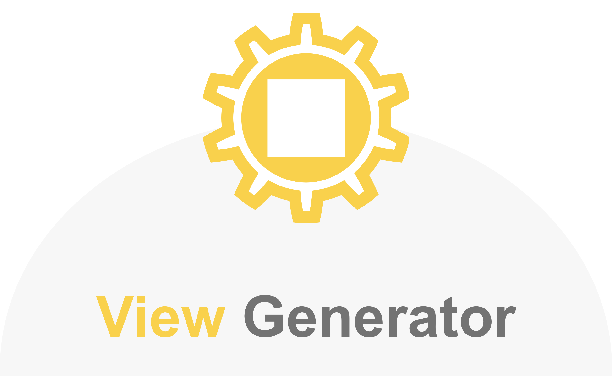

<p align="center">
    
</p>

<p align="center">
  <a href=https://travis-ci.org/funzin/ViewGenerator>
    
  </a>
  <a href=https://codecov.io/gh/funzin/ViewGenerator>
    
  </a>
  
  <a href="https://developer.apple.com/swift">
    
  </a>
  <a href="./LICENSE">
    
  </a>
  <a href=https://sonarcloud.io/dashboard?id=funzin_ViewGenerator> 
    
  </a>
  <a href="https://twitter.com/fufunzin">
    
  </a>
</p>

## Overview
ViewGenerator generates view code from variable name automatically when you create view by code in iOS development

## Download
<a href="https://apps.apple.com/us/app/viewgenerator-for-xcode/id1476703048?l=ja&ls=1&mt=12">
  
</a>


## Environment
- Xcode 10.3 or greater
- Swift 5.0 or greator

## Demo


## Install
1. Install [ViewGenerator](https://apps.apple.com/us/app/viewgenerator-for-xcode/id1476703048?l=ja&ls=1&mt=12) from AppStore


2. Enable ViewGenerator
    1. `System Preferences` → `Extensions`
    2. Switch on `Xcode Source Editor` checkbox


  

## Usage
1. Input variable name <br>
  **⚠Important⚠ : variable name must be included class name without `UI` as suffix.** (e.g. `hogeView`, `hogeLabel`, etc.) <br>
  Please check [Support View List](https://github.com/funzin/ViewGenerator#support-view-list) bellow
2. Select variable name
3. `Editor`→`ViewGenerator`→`Generate View Code`


4. Generated⚒

### Recommend
**I strongly recommend that you register `Generate View Code` Command to shortcut**

1. `Xcode Preferences` →　`KeyBindings`
2. Input `ViewGenerator` in Search
3. Register shortcut


### Usage Example
#### Multiple variables
||GIF|
|:-:|:-:|
|select||

#### Single Variable
||GIF|
|:-:|:-:|
|not_select||
|select||

### Supplement
Default access modifier is **private** . if you change access modifier, open viewgenerator app and then select access modifier that you want to select


## Example

For example, if variable name prefix is `hoge`, it is generated as bellow 

hogeView
```swift
private let hogeView: UIView = {
    let hogeView = UIView(frame: .zero)
    hogeView.translatesAutoresizingMaskIntoConstraints = false
    return hogeView
}()
```

hogeButton
```swift
private let hogeButton: UIButton = {
    let hogeButton = UIButton(frame: .zero)
    hogeButton.translatesAutoresizingMaskIntoConstraints = false
    return hogeButton
}()
```

<details>
<summary>hogeTableView</summary>
<div>
    
```swift
private let hogeTableView: UITableView = {
    let hogeTableView = UITableView(frame: .zero)
    hogeTableView.translatesAutoresizingMaskIntoConstraints = false
    return hogeTableView
}()
```
</div>
</details>

<details>
<summary>hogehoge</summary>
<div>
    
```swift
private let hogehoge: _InputTypeName_ = {
    let hogehoge = _InputTypeName_(frame: .zero)
    hogehoge.translatesAutoresizingMaskIntoConstraints = false
    return hogehoge
}()
```
</div>
</details>


### Support View List
|View|
|:-:|
|`UISwitch`|
|`UIActivityIndicatorView`|
|`UIButton`|
|`UICollectionView`|
|`UIControl`|
|`UIDatePicker`|
|`UIImageView`|
|`UILabel`|
|`UINavigationBar`|
|`UIPageControl`|
|`UIPickerView`|
|`UIProgressView`|
|`UIScrollView`|
|`UISearchBar`|
|`UISegmentedControl`|
|`UISlider`|
|`UIStackView`|
|`UIStepper`|
|`UITabBar`|
|`UITableView`|
|`UITextField`|
|`UITextView`|
|`UIToolbar`|
|`UIView`|
|`UIVisualEffectView`|

If you input variable name that doesn't correspond to the support view list, type name is input as `_InputTypeName_`  automatically.


## Contact
If you discover problem or have opinions, please let me know through Github issues💁‍♂️

## Author
funzin
- mail: nakazawa.fumito@gmail.com

## License
ViewGenerator is available under the MIT license. See the [LICENSE](./LICENSE) file for more info.
